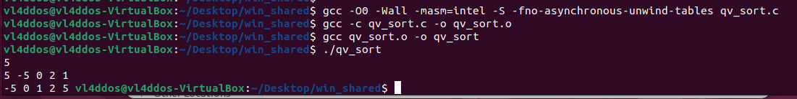
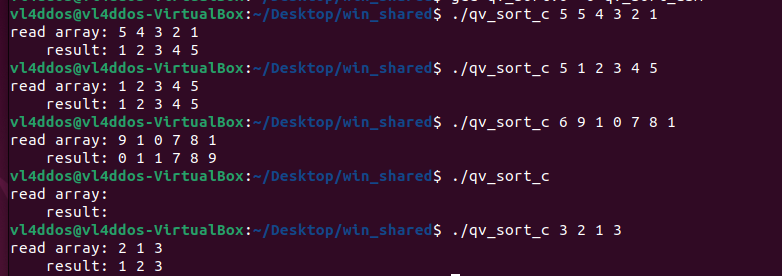
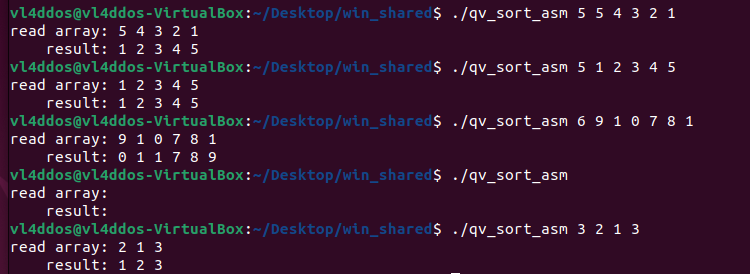
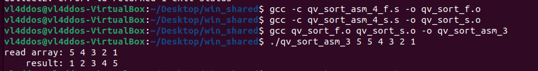
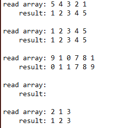

# Индивидуальное домашнее задание по АВС #1
## Сизикин Владислав Олегович (БПИ218), Вариант 21

## Формат входных данных: 
Передается целое число n, затем передаются n целых чисел (через параметры командной строки)
1. 0 <= n <= 1000, n - целое число
2. -1000 <= a[i] <= 1000
Пример: 5 1 2 3 4 5

# 4 балла
В файле [qv_sort_1.c](code/qv_sort_1.c) находится решение задачи на C (пункт 1).
Сперва была выполнена компиляция без оптимизирующих и отладочных функций, добавлены комментарии, поясняющие эквивалентное представление переменных в программе на C и в ассемблерном коде (пункт 2).

Ассемблерные файлы: [без оптимизаций](code/qv_sort_1_not_optimized), [с оптимизациями](code/qv_sort_1_optimized).

команда без оптимизаций:
gcc -O0 -Wall -masm=intel -S fno-asynchronous-unwind-tables qv_sort.c -o qv_sort.s

Получили следующий [код](code/qv_sort_1_not_optimized)

Далее была произведена сборка с использованием следующей команды:

gcc -O2 -Wall -masm=intel -fno-asynchronous-unwind-tables -fcf-protection=none -S qv_sort.c -o qv_sort.s

Таким образом, мы получили ассемблерный [код](code/qv_sort_1_optimized) без лишних макросов (пункт 3).

Приложил тестовое покрытие, проверяющее корректную и одинаковую работу программ на C и ассемблере (пункт 4).

!Важное примечание - в пункте 5 я буду модифицировать ассемблерный код, который я получил БЕЗ оптимизаций (для понятности)

# 5 баллов
Начал модификацию предыдущего файла на C, вынес некоторые части кода в отдельные функции, получил [qv_sort_2.c](code/qv_sort_2.c) (пункт 1)

Получил следующий [ассемблерный код](code/qv_sort_2.s)

Локальные переменные были использованы, например 'int n' в main и 'int temp' в sort (пункт 2).

Произвел сборку, добавил комментарии, описывающие передачу фактических параметров и перенос возвращаемого результата в ассемблерный код (пункт 3).

В функции добавил комментарии для формальных параметров, описывающие связь между регистрами и стэком и параметрами языка C (пункт 4).

# 6 баллов
Произвел оптимизацию программы ассемблера за счет использования регистров процессора (скомпилировали с -O2). Теперь программа использует регистры r12-r15 (пункт 1).

Получил следующий [ассемблерный код](code/qv_sort_3.s)

Добавил комментарии, поясняющие альтернативное использование регистров вместо переменных исходной программы на С (пункт 2).

Произвел тестирование, приложил результаты. Программа работает корректно, судя по итогам тестов (пункт 3).

![imgs/test_asm_3.png]

# 7 баллов
Разбил ассемблерный файл на две единицы компиляции (пункт 1).

[Первая](code/qv_sort_asm_4_f.s), [вторая](code/qv_sort_asm_4_s.s)

Произвел успешную сборку программы:

Добавил возможность задания файлов ввода/вывода с использованием аргументов командной строки (пункт 2).

Код на [Си](code/qv_sort_fileinp.c), [ассемблер](code/qv_sort_asm_fileinp.s)

Произвел тестирование, приложил результаты. Вывод: программа работает корректно (пункт 3).

